<p align="center">
  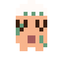
  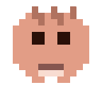
  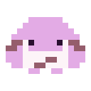
  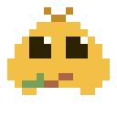
  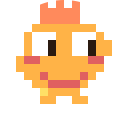
  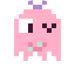
  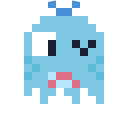
  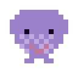
  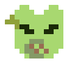
  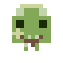
  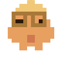
  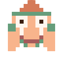
</p>

<h1 align="center">lil_guy</h1>

<p align="center">
  Deterministic pixel art avatars from any string.<br />
  ~390 billion unique characters. Zero dependencies. 6 KB gzipped.
</p>

<p align="center">
  <a href="#install">Install</a> ·
  <a href="#quick-start">Quick Start</a> ·
  <a href="#react-component">React</a> ·
  <a href="#nextjs">Next.js</a> ·
  <a href="#headless">Headless</a> ·
  <a href="#api">API</a> ·
  <a href="demo.html">Demo</a> ·
  <a href="https://isaacaudet.github.io/lil_guy/">Explore</a>
</p>

---

Pass any string — an email, username, wallet address — and get back a cute, deterministic blob character. Same input always produces the same lil guy.

Works everywhere: React component with 3D hover + blink animation, headless SVG/PNG generation, Next.js image API route, or plain `<script>` tag.

**[Make yours →](https://isaacaudet.github.io/lil_guy/)** — type anything, get your guy, save him as a PNG with or without his name. Behind it is the gallery: an endless plane where each cell's coordinates *are* the seed, so there is no list and no edge. The lattice is a spring mesh, so it stretches behind your hand and rings down when you let go.

## Install

```bash
npm install lil_guy
```

## Quick Start

### React

```tsx
import { LilGuy } from "lil_guy";

function UserAvatar({ email }: { email: string }) {
  return <LilGuy name={email} size={48} />;
}
```

### Headless (no React)

```ts
import { toSvgString } from "lil_guy";

const svg = toSvgString("alice@example.com");
// → complete SVG string, use anywhere
```

### Script tag

```html
<script src="https://unpkg.com/lil_guy/dist/lil-guy.js"></script>
<script>
  const svg = LilGuy.toSvgString("alice@example.com");
  document.getElementById("avatar").textContent = svg;
</script>
```

## React Component

The `<LilGuy>` component renders an interactive pixel art avatar with 3D tilt and blink animation.

```tsx
<LilGuy
  name="alice@example.com"
  size={64}
  shape="circle"       // "circle" | "square"
  variant="gradient"   // "gradient" | "solid" | "transparent"
  interactive          // 3D hover effect (default: true)
  enableBlink          // blink animation
  intensity3d="dramatic" // "none" | "subtle" | "medium" | "dramatic"
/>
```

### Pin specific parts

Override individual features while keeping the rest deterministic:

```tsx
<LilGuy name="alice" parts={{ hair: 2, eyes: 0 }} />
```

### Compound avatar (image with fallback)

```tsx
import { Avatar, AvatarImage, AvatarFallback } from "lil_guy";

<Avatar>
  <AvatarImage src="/photos/alice.jpg" alt="Alice" />
  <AvatarFallback name="alice@example.com" size={48} />
</Avatar>
```

## Next.js

Two-line API route that serves avatar PNGs. Caches forever since the output is deterministic.

```ts
// app/api/avatar/route.ts
import { toLilGuyHandler } from "lil_guy/next";

export const { GET } = toLilGuyHandler();
```

Then use it anywhere:

```html

```

## Headless

Generate SVG strings or PNG data URLs without React or a DOM.

```ts
import { toSvgString, toPng } from "lil_guy";

// SVG string — works in Node, Deno, Bun, browsers
const svg = toSvgString("alice", { size: 256 });

// PNG data URL — browser only (needs canvas)
const png = await toPng("alice", { size: 256 });
```

### Pipeline access

For full control, use the pipeline directly:

```ts
import { hash, resolve, compose, getPalette, resolveColor } from "lil_guy";

const config = resolve("alice");     // → { head: 3, eyes: 1, mouth: 2, ... }
const grid = compose(config);        // → 16×16 number[][] of color tokens
const palette = getPalette(config.palette);
const color = resolveColor(palette, grid[8][8]); // → "#FFB347"
```

## API

### `<LilGuy>` Props

| Prop | Type | Default | Description |
|------|------|---------|-------------|
| `name` | `string` | — | Input string to generate avatar from |
| `size` | `number \| string` | `40` | Size in px or CSS units |
| `shape` | `"circle" \| "square"` | `"circle"` | Avatar shape |
| `variant` | `"gradient" \| "solid" \| "transparent"` | `"transparent"` | Background style |
| `interactive` | `boolean` | `true` | Enable 3D hover effect |
| `enableBlink` | `boolean` | `false` | Enable blink animation |
| `intensity3d` | `"none" \| "subtle" \| "medium" \| "dramatic"` | `"dramatic"` | 3D rotation intensity |
| `parts` | `object` | — | Pin specific features by index |
| `palette` | `Palette` | — | Override color palette |
| `showInitial` | `boolean` | `false` | Show first letter overlay |
| `title` | `string` | — | Accessible name. Omit when the avatar sits beside the name it represents — it is then marked decorative |

The blink and the hover tilt both stop under `prefers-reduced-motion`.

### `toSvgString(input, options?)`

Returns a complete SVG string. No DOM or React needed. Horizontal runs of one
colour are merged into a single `<rect>`, which is roughly a third the size of
one rect per pixel.

Pass `title` to give the SVG an accessible name; without it the SVG is marked
decorative (`aria-hidden`), which is what you want beside a visible username.

### `toPng(input, options?)`

Returns a PNG data URL. Browser only.

### `toLilGuyHandler(options?)`

Creates a Next.js route handler. Returns `{ GET }`.

## How It Works

1. **Hash** — FNV-1a hash of the input string, with independent per-slot hashing for each feature
2. **Resolve** — Hash selects head shape, eyes, mouth, hair, body pattern, accessory, palette, and rotation from the part library. Picks are weighted (`src/parts/weights.ts`) so the set keeps its character as the library grows — a uniform roll over a big library averages out to something bland. Every part still turns up; the odd ones are just rarer
3. **Compose** — Layers parts onto a 16×16 grid using a token system (body, feature, pattern, accent, eyes, mouth). Each layer is placed relative to the head it landed on: hats are trimmed to the width of the skull they rest on, the face block follows the head's centre, and cheek marks slide in to hug the silhouette. Nothing floats
4. **Render** — Tokens map to palette colors and render as SVG rects. Each palette's tokens are held clear of its body colour first: the mouth carries the expression and the pattern colour draws the crown of a hat, and several palettes were authored with those within a hair of the blob they sit on

20 heads × 23 eyes × 20 mouths × 34 toppers × 28 bodies × 29 accessories × 32 palettes = ~8.1 billion drawn combinations, times four modifiers (2 mirror × 3 shade × 4 feet × 2 pattern tone) = **~390 billion** unique characters.

Weighting makes the charming parts common and the odd ones rare, so the *effective* variety — how many equally-likely guys the set behaves like — is about 152 billion. Every combination is still reachable.

### Modifiers

Four axes transform a guy rather than adding drawn art to it, so each one
multiplies across the whole library. All of them are deterministic, and all of
them can be pinned through `parts`:

| Modifier | Values | What it does |
|---|---|---|
| `flip` | `boolean` | Mirrors the finished character. 53 of the 154 parts are asymmetric, so a mirrored guy reads as a different one |
| `shade` | `0-2` | Palette tone: soft, as authored, deep. Applied to body/feature/pattern/accent/outline/mouth; the eye white and pupil are left alone so the face keeps its contrast |
| `feet` | `0-3` | Stance: as drawn, nubs, wide, stilts. `0` keeps whatever the head was drawn with, which is what preserves the ghost's drips |
| `patternTone` | `0-1` | Draws the body pattern in the pattern colour or the accent colour |

```tsx
<LilGuy name="alice" parts={{ shade: 2, feet: 3, flip: true }} />
```

## License

MIT
